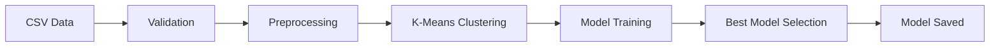
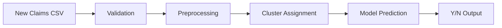

## What is the Fraud Detection System?

The fraud detection system is an end-to-end machine learning application designed to identify fraudulent insurance claims. Built with Flask and powered by advanced ML algorithms, it provides automated fraud detection through a REST API interface.

<Info>
  The system uses a hybrid approach combining **unsupervised clustering** (K-Means) with **supervised classification** (XGBoost and SVM) to achieve high accuracy in fraud detection.
</Info>

## High-Level Workflow

The system operates through two main pipelines:

### Training Pipeline

1. **Data Validation** - Validates incoming CSV files against schema (`schema_training.json`)
2. **Data Preprocessing** - Handles missing values, encodes categorical features, scales numerical features
3. **K-Means Clustering** - Groups similar insurance claims using elbow method for optimal clusters
4. **Model Training** - Trains XGBoost and SVM models on each cluster
5. **Model Selection** - Selects best performing model per cluster based on AUC/accuracy scores
6. **Model Persistence** - Saves trained models for prediction

### Prediction Pipeline

1. **Data Validation** - Validates prediction data against schema (`schema_prediction.json`)
2. **Preprocessing** - Applies same transformations as training
3. **Cluster Assignment** - Uses saved K-Means model to assign clusters
4. **Prediction** - Applies cluster-specific best model
5. **Output Generation** - Returns fraud predictions (Y/N) in CSV format

## Key Technologies

<CardGroup cols={2}>
  <Card title="Flask" icon="flask">
    Web framework providing REST API endpoints (`/train`, `/predict`) and monitoring dashboard integration
  </Card>
  
  <Card title="XGBoost" icon="tree">
    Gradient boosting classifier with hyperparameter tuning via GridSearchCV for binary fraud classification
  </Card>
  
  <Card title="SVM" icon="vector-square">
    Support Vector Machine with RBF/sigmoid kernels, used as alternative classifier in model selection
  </Card>
  
  <Card title="K-Means" icon="circle-nodes">
    Unsupervised clustering algorithm that segments claims into groups before classification
  </Card>
</CardGroup>

### Additional Libraries

- **scikit-learn** - Model training, preprocessing, and evaluation
- **Pandas & NumPy** - Data manipulation and numerical operations
- **Flask-MonitoringDashboard** - Performance monitoring and API analytics
- **imbalanced-learn** - Handling imbalanced datasets with RandomOverSampler

## Use Cases for Insurance Fraud Detection

<AccordionGroup>
  <Accordion title="Automated Claims Review">
    Screen incoming insurance claims automatically before manual review, flagging high-risk claims for detailed investigation.
  </Accordion>
  
  <Accordion title="Batch Processing">
    Process large batches of historical claims to identify patterns and potentially fraudulent activities that were previously missed.
  </Accordion>
  
  <Accordion title="Risk Scoring">
    Integrate predictions into risk assessment workflows to prioritize investigator resources on claims most likely to be fraudulent.
  </Accordion>
  
  <Accordion title="Pattern Detection">
    Leverage clustering approach to identify unusual claim patterns and emerging fraud schemes across different customer segments.
  </Accordion>
</AccordionGroup>

## System Features

- **Schema-based Validation** - Enforces data quality with JSON schema validation
- **Automated Preprocessing** - Handles missing values, categorical encoding, and feature scaling
- **Cluster-based Modeling** - Trains specialized models for different claim segments
- **Model Comparison** - Automatically selects best performing algorithm (XGBoost vs SVM)
- **REST API Interface** - Easy integration with existing systems
- **Monitoring Dashboard** - Track API performance and usage metrics
- **Batch Predictions** - Process multiple claims efficiently

<Check>
  **Production Ready** - The system includes comprehensive logging, error handling, and is ready for deployment with Gunicorn/Nginx.
</Check>

## Next Steps

<CardGroup cols={2}>
  <Card title="Architecture" icon="sitemap" href="/concepts/architecture">
    Explore the technical architecture and module organization
  </Card>
  
  <Card title="Data Pipeline" icon="pipe" href="/concepts/data-pipeline">
    Deep dive into data ingestion and transformation processes
  </Card>
  
  <Card title="Fraud Detection" icon="shield-check" href="/concepts/fraud-detection">
    Learn about the fraud detection methodology and features
  </Card>
</CardGroup>